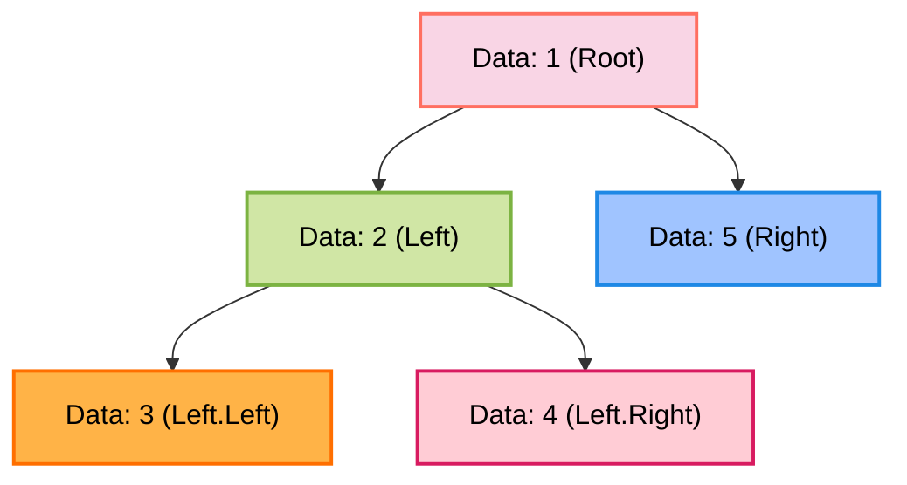
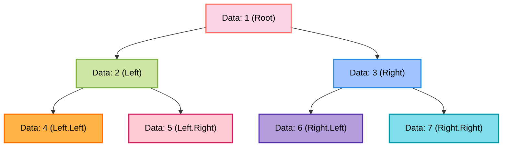
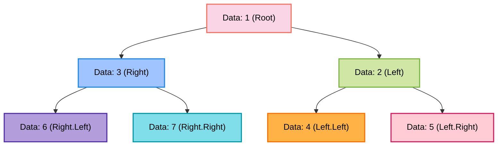

<h1 align="center">🌳 Data Structures Lab – Binary Trees (Java)</h1>


---

## 📺 Lecture Video
Watch the full Binary Trees lab lecture on YouTube:  
👉 [Binary Trees Lecture](https://youtu.be/your_video_link)

---

## 1. 🌟 Introduction

A **Binary Tree (BT)** is a hierarchical data structure where each node has at most **two children**: left and right. Binary trees are essential for:

- Efficient searching (Binary Search Trees)
- Expression parsing and evaluation
- Hierarchical data representation
- Recursion understanding

**Key Terminology:**
- **Root:** Topmost node
- **Leaf:** Node with no children
- **Height:** Longest path from root to a leaf
- **Depth:** Distance from root to node
- **Subtree:** Tree rooted at any node

---

## 2. 🧠 Core Concepts

### 🔹 Tree Node Structure
```java
public class TreeNode<T> {
    T data;
    TreeNode left;
    TreeNode right;

    public TreeNode(T data) {
        this.data = data;
        this.left = null;
        this.right = null;
    }
}
```

**Explanation:**

- Each node contains a value (`data`) and pointers to **left** and **right** children.
- Root node is the starting point of the tree.

---

## 🔹 Binary Tree Traversals

Traversal means visiting nodes **in a specific order.**

### 1️⃣ Preorder Traversal (Root → Left → Right)

```java
void preorder(TreeNode root) {
    if (root == null) return;
    System.out.print(root.data + " ");
    preorder(root.left);
    preorder(root.right);
}
```

**Mermaid Diagram**



**✅ Preorder traversal order (data values):** `1 → 2 → 3 → 4 → 5`

**Explanation:**

- Visit **root first**, then traverse **left subtree**, then **right subtree**.
- Used for copying trees or expression evaluation.

---

### 2️⃣ Inorder Traversal (Left → Root → Right)

```java
void inorder(TreeNode root) {
    if (root == null) return;
    inorder(root.left);
    System.out.print(root.data + " ");
    inorder(root.right);
}
```

**Mermaid Diagram**



**✅ Inorder traversal order (data values):** `4 → 2 → 5 → 1 → 6 → 3 → 7`

**Explanation:**

- Left subtree → root → right subtree
- For **BST**, inorder traversal prints sorted values.

---

### 3️⃣ Postorder Traversal (Left → Right → Root)

```java
void postorder(TreeNode root) {
    if (root == null) return;
    postorder(root.left);
    postorder(root.right);
    System.out.print(root.data + " ");
}
```

**Mermaid Diagram**



**✅ Postorder traversal order (data values):** `4 → 5 → 2 → 6 → 7 → 3 → 1`

**Explanation:**

- Visit left → right → root
- Used in **deleting a tree** or **expression evaluation.**

---

## 3. 📂 Repository Structure

```pgsql
java-ds-lab-trees/
│
├── README.md
│
├── src/
│   ├── examples/
│   │   ├── TreeNode.java
│   │   ├── BinaryTreeTraversal.java
│   │
│   ├── activities/
│   │   ├── HeightOfBinaryTree.java
│   │   ├── LevelOrderTraversal.java
│   │   ├── CheckHeightBalanced.java
│   │   ├── BuildTreeFromPreIn.java
│   │   └── LowestCommonAncestor.java
│   │
│   └── chapters/
│       └── Lecture 06 - Binary Trees.pdf
│
└── .gitignore
```

---

## 4. 🖥 Lecture Examples (Explained in Class)

### 🌲 Binary Tree Class

- Encapsulates the **TreeNode** root and basic methods.
- Supports traversal methods: **preorder, inorder, postorder.**
- Includes **example tree building** for demonstration.

```java
TreeNode root = new TreeNode(1);
root.left = new TreeNode(2);
root.right = new TreeNode(3);
root.left.left = new TreeNode(4);
root.left.right = new TreeNode(5);
```

> This creates the tree:
> ```pgsql
>       1
>      / \
>     2   3
>    / \
>   4   5

---

## 5. 🎯 Activities (Student Practice)

These exercises are **for students to implement. No solutions are included here.**

| Activity                           | Concept                    | Hints                                            |
| ---------------------------------- | -------------------------- | ------------------------------------------------ |
| Height of Binary Tree              | Recursion, tree depth      | Use `max(leftHeight, rightHeight)+1`             |
| Level Order Traversal              | Queue + tree               | Use a queue to visit nodes level by level        |
| Check if Tree is Height Balanced   | Recursion, tree height     | Compare heights of left and right subtree        |
| Build Tree from Preorder & Inorder | Tree construction          | Use preorder[0] as root, split inorder array     |
| Lowest Common Ancestor             | Recursion, ancestor search | Traverse tree, return root if left & right exist |

---

## 6. 🏃 Running the Code

```bash
git clone https://github.com/Maryam-Skaik/java-ds-lab-trees.git
cd java-ds-lab-trees/src/examples
javac *.java
java BinaryTreeTraversal
```

---

## 7. 💡 Tips for Students

- Draw the tree before coding.
- Trace recursive calls manually.
- Remember traversal order:
  - **Preorder**: Root → Left → Right
  - **Inorder**: Left → Root → Right
  - **Postorder**: Left → Right → Root
 
---

## 8. 🎓 Learning Outcomes

After this lab, students will:

- Build and traverse binary trees
- Understand recursive tree operations
- Implement tree-based algorithms like LCA, height calculation, and level-order traversal
- Prepare for advanced tree structures (BST, AVL, Heaps)

---

## 9. 📝 License

This project is provided for educational use in the Java Data Structures Lab.
