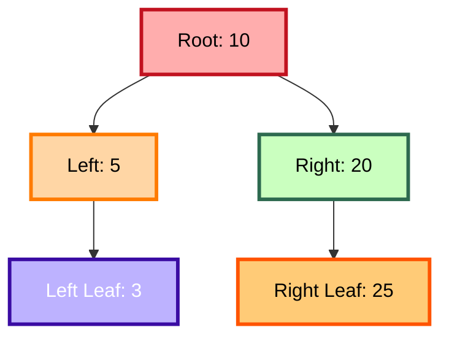
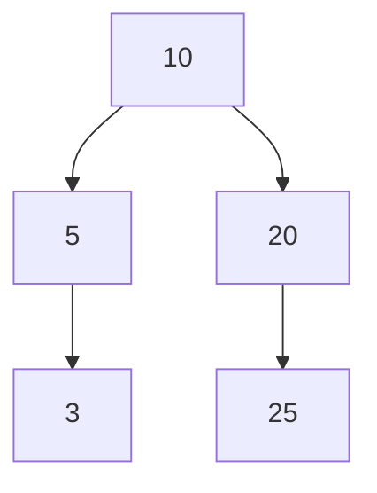
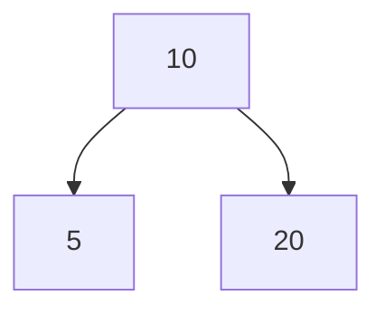
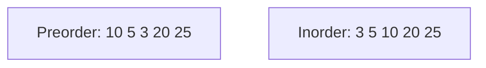

# 🌳 Binary Tree Activities – Data Structures Lab (Java)

This folder contains **practice activities** for **Lecture 07 – Binary Trees** in the Data Structures Lab.
These activities are designed to help students **apply Binary Tree concepts using Java**.

> 🎯 **Goal**: Strengthen your understanding of **tree traversal**, **tree construction**, and **tree analysis** through practical exercises.

---

## 📂 Folder Structure

```pgsql
activities/
├── TreeHeight.java
├── LevelOrderTraversal.java
├── HeightBalancedCheck.java
├── BuildTreeFromTraversal.java
└── DeepestNodeFinder.java
```

Each file represents** one activity/problem** that you are required to solve.

---

## 🎥 Reference Material

Before attempting these activities, make sure you:

- Watch **[Lecture 07 – Binary Trees](https://youtu.be/ph8W8z3wDZI)**
- Review the Binary Tree examples discussed in class
- Understand recursion, queues, and tree node structure
- **after**, **Watch the Solution Video for step-by-step explanations:** [Watch the Solutions Video](https://youtu.be/UJayMTP7ye0)

---

## 🤔 Why These Activities Matter

Binary trees are used in many algorithms and data structures:

- Searching (BST)
- Expression parsing
- Priority queues and heaps
- Hierarchical data representation

These activities train you to:

- Implement recursive solutions
- Understand tree traversal logic
- Build and analyze trees in Java

---

## ⏳ About Solutions to Activities

The solutions to these activities are now available! Below, you'll find a **detailed explanation** of each solution, with **time complexity analysis and mermaid visualizations.**

---

## 🧩 Activity 1: Height of a Binary Tree

File: [`TreeHeight.java`](activities/TreeHeight.java)

### 🔍 Problem Statement

Given a binary tree, compute its **height**.
Height is defined as the number of edges in the longest path from the **root to a leaf node**.

### 📌 Rules

- Use recursion
- Base case: empty tree returns height `-1`
- Height of a node = `1 + max(left subtree height, right subtree height)`

### 🧠 Approach

- Recursively calculate the height of left and right subtrees.
- Return `1 + max(leftHeight, rightHeight)` for the current node.

### 🕒 Time Complexity

- **Time Complexity: O(n)**, n = number of nodes
- **Space Complexity: O(h)**, h = height of tree (recursion stack)

### 📐 Visualization



---

## 🧩 Activity 2: Level Order Traversal (BFS)

File: [`LevelOrderTraversal.java`](activities/LevelOrderTraversal.java)

### 🔍 Problem Statement

Print the nodes of a binary tree **level by level (Breadth-First Search).**

### 📌 Rules

- Use a queue
- Traverse each level completely before moving to the next

### 🧠 Approach

- Enqueue the root node.
- While the queue is not empty:
  - Dequeue a node and print its value
  - Enqueue left and right children if they exist

### 🕒 Time Complexity

- **Time Complexity: O(n)**
- **Space Complexity: O(n)** for the queue

### 📐 Visualization



**Level Order Output:** `10 5 20 3 25`

---

## 🧩 Activity 3: Check Height-Balanced Tree

File: [`HeightBalancedCheck.java`](activities/HeightBalancedCheck.java)

### 🔍 Problem Statement

Check whether a binary tree is **height-balanced.**
A tree is balanced if the heights of left and right subtrees of **every node** are equal.

### 📌 Rules

- Use recursion
- Base case: empty node is balanced
- Compare leftHeight vs rightHeight at each node

### 🧠 Approach

- Calculate left and right subtree heights
- If heights differ, tree is **not balanced**
- Recursively check left and right subtrees

### 🕒 Time Complexity

- **Time Complexity: O(n log n)** (height function called at each node)
- **Space Complexity: O(h)**

### 📐 Visualization



**Balanced:** Yes, heights of subtrees are equal

---

## 🧩 Activity 4: Build Tree from Preorder and Inorder Traversal

File: [`BuildTreeFromTraversal.java`](activities/BuildTreeFromTraversal.java)

### 🔍 Problem Statement

Given preorder and inorder traversal arrays, **construct the binary tree.**

### 📌 Rules

- Preorder: root -> left -> right
- Inorder: left -> root -> right
- Use recursion to split the arrays for left and right subtrees

### 🧠 Approach

- Take the next element from preorder as root
- Find it in inorder to split left and right
- Recursively build left and right subtrees

### 🕒 Time Complexity

- **Time Complexity: O(n^2) **in worst case
- **Space Complexity: O(n)** for recursion stack

### 📐 Visualization



**Constructed Tree**


---

## 🧩 Activity 5: Find Deepest Node

File: [`DeepestNodeFinder.java`](activities/DeepestNodeFinder.java)

### 🔍 Problem Statement

Find the **deepest (last) node** in a binary tree.

### 📌 Rules

- Use level order traversal
- Return the last node processed

### 🧠 Approach

- Enqueue root node
- While queue not empty:
- Dequeue node and enqueue children
- Last node dequeued is the deepest

### 🕒 Time Complexity

- **Time Complexity: O(n)**
- **Space Complexity: O(n)**

### 📐 Visualization

```mermaid
graph TD
    A["10"] --> B["5"]
    A --> C["20"]
    B --> D["3"]
    C --> E["25"]

Deepest Node: 25
```

---

## 🚫 Common Student Mistakes

❌ Confusing recursion base case<br>
❌ Forgetting to enqueue/dequeue in BFS<br>
❌ Miscalculating heights in balanced check<br>
❌ Not splitting arrays correctly in tree construction<br>
❌ Ignoring edge cases (empty tree, single node)

---

## 🎯 Learning Outcomes

After completing these activities, students should be able to:

- Compute tree **height and deepest node**
- Perform **level order traversal**
- Check if a tree is **height-balanced**
- Construct a tree from traversal arrays
- Understand recursion, BFS, and queue usage in trees
- Write clean and efficient Java code

---

## 👩‍🏫 Instructor

**Maryam Skaik**<br>
Teaching Assistant – Data Structures & Algorithms<br>
Java | Binary Trees | Recursion | Queue

> *🌱 Practice these activities well — these concepts appear frequently in exams and projects.*
